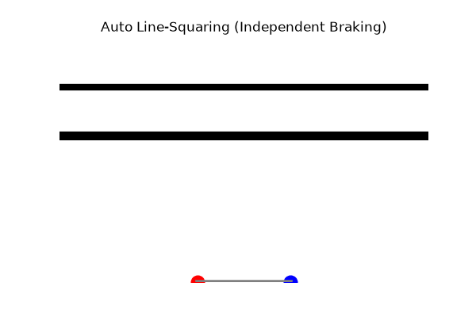

# EV3Kernel - API Reference (คู่มือการใช้งาน)

เอกสารนี้รวบรวมฟังก์ชันและพารามิเตอร์ทั้งหมดที่ใช้ในการเขียนโค้ดภารกิจ (Mission Scripts)

---

## 1. KINEMATICS & ODOMETRY (ระบบขับเคลื่อนและวัดระยะ)

<details>
<summary><b>[+] <code>move_straight(distance_cm, max_speed)</code></b></summary>

สั่งให้หุ่นยนต์วิ่งตรงไปข้างหน้าหรือถอยหลัง โดยใช้ระบบ Closed-loop PID คอยดึงล้อซ้าย-ขวาให้ความเร็วเท่ากันตลอดเวลา ป้องกันหุ่นวิ่งเอียง

**พารามิเตอร์ (Parameters):**
* `distance_cm`: ระยะทางที่ต้องการให้วิ่ง (เซนติเมตร) ใส่ค่าบวกเพื่อเดินหน้า ใส่ค่าลบเพื่อถอยหลัง
* `max_speed`: ความเร็วสูงสุด (0-100%)

**ตัวอย่างการใช้งาน:**
```python
robot.move_straight(50, max_speed=50)   # เดินหน้า 50 ซม. ความเร็ว 50%
robot.move_straight(-20, max_speed=40)  # ถอยหลัง 20 ซม. ความเร็ว 40%
```
</details>

<details>
<summary><b>[+] <code>turn(angle_deg, max_speed)</code></b></summary>

เลี้ยวอยู่กับที่ (Point turn) โดยล้อซ้ายและขวาจะหมุนสวนทางกัน ใช้ PID ควบคุมให้ล้อทั้งสองข้างขยับเท่ากันแบบเป๊ะๆ

**พารามิเตอร์ (Parameters):**
* `angle_deg`: องศาเป้าหมายที่ต้องการเลี้ยว (บวก = เลี้ยวขวา, ลบ = เลี้ยวซ้าย)
* `max_speed`: ความเร็วสูงสุดในการหมุน (0-100%)

**ตัวอย่างการใช้งาน:**
```python
robot.turn(90, max_speed=40)   # เลี้ยวขวา 90 องศา
robot.turn(-90, max_speed=40)  # เลี้ยวซ้าย 90 องศา
```
</details>

<details>
<summary><b>[+] <code>pivot_turn(angle_deg, pivot_side, max_speed)</code></b></summary>

เลี้ยวแบบวงกว้าง (Pivot turn) โดยล็อกล้อข้างหนึ่งให้อยู่กับที่ และหมุนล้ออีกข้างหนึ่ง

**พารามิเตอร์ (Parameters):**
* `angle_deg`: องศาเป้าหมาย (บวก = หน้าขวา/หลังซ้าย, ลบ = หน้าซ้าย/หลังขวา)
* `pivot_side`: `'left'` (ล็อกซ้าย) หรือ `'right'` (ล็อกขวา)

**ตัวอย่างการใช้งาน:**
```python
robot.pivot_turn(90, pivot_side='right')  # ล็อกล้อขวา, หมุนล้อซ้ายเดินหน้า
```
</details>

---

## 2. ALIGNMENT & HOMING (ระบบเทียบเส้นและกำแพง)

<details>
<summary><b>[+] <code>align_wall(power, time_ms)</code></b></summary>

วิ่งถอยชนกำแพงเพื่อจัดระเบียบหุ่นยนต์ (ตั้งลำให้ขนานกับกำแพง) โดยมีการควบคุมกระแสไฟ (PWM Limit) เพื่อไม่ให้เฟืองมอเตอร์แตกเมื่อเกิดอาการชนแล้วค้าง (Stall)

**พารามิเตอร์ (Parameters):**
* `power`: แรงดันไฟที่ใช้ดันกำแพง (ใส่ค่าบวก=เดินหน้าชน, ลบ=ถอยหลังชน)
* `time_ms`: เวลาที่ใช้ดันกำแพง (มิลลิวินาที) เช่น `1500` = 1.5 วินาที

**ตัวอย่างการใช้งาน:**
```python
robot.align_wall(power=-50, time_ms=1500)
```
</details>

<details>
<summary><b>[+] <code>align_line(time_ms)</code></b></summary>

เทียบเส้นตั้งฉากกับเส้นตัดขวาง โดยใช้เซนเซอร์แสง 2 ตัว

**พารามิเตอร์ (Parameters):**
* `time_ms`: ระยะเวลาที่ใช้ในการเทียบเส้น

**หลักการทำงาน (Line Squaring Logic):**
ล้อข้างที่เซ็นเซอร์เจอเส้นดำก่อนจะหยุดและล็อกทันที ในขณะที่ล้ออีกข้างจะหมุนต่อไปจนกว่าจะเจอเส้น ทำให้หุ่นปรับหน้ากระดานตั้งฉากกับเส้นขวางได้อย่างสมบูรณ์

<div align="center">
  
  <p><em>Simulated Line Squaring where the left sensor hits the line first and brakes, waiting for the right side to align.</em></p>
</div>

```text
// Independent Line Squaring Logic
if (Left_Sensor_Sees_Black)  -> Stop Left Motor
if (Right_Sensor_Sees_Black) -> Stop Right Motor
```
</details>

---

## 3. SENSOR FUSION & LINE TRACKING (ระบบเกาะเส้น 333Hz)

<details>
<summary><b>[+] <code>drive_until_line(speed, align=True)</code></b></summary>

สั่งให้หุ่นยนต์วิ่งตรงไปข้างหน้าจนกว่าเซนเซอร์ทั้งซ้ายและขวาจะตัดผ่านเส้นดำ

**พารามิเตอร์ (Parameters):**
* `speed`: ความเร็ว (0-100%)
* `align`: หากตั้งเป็น `True` หุ่นยนต์จะเรียกฟังก์ชัน `align_line()` อัตโนมัติเมื่อเจอเส้น เพื่อจัดหน้ากระดานให้ตั้งฉากทันที
</details>

<details>
<summary><b>[+] <code>track_line(speed, kp, kd)</code></b></summary>

วิ่งคร่อมเส้นดำ (Straddle) ด้วยเซนเซอร์คู่ โดยใช้ระบบควบคุมแบบ PD จนกว่าจะเจอทางแยก (Intersection)

**พารามิเตอร์ (Parameters):**
* `speed`: ความเร็วสูงสุดที่ใช้เกาะเส้น
* `kp`: ค่า Proportional (แรงเลี้ยวต้านกลับเมื่อหลุดเส้น)
* `kd`: ค่า Derivative (แรงเบรกกันส่าย)
</details>

<details>
<summary><b>[+] <code>track_line_distance(distance_cm, speed, kp, kd)</code></b></summary>

วิ่งคร่อมเส้นดำด้วยระยะทางที่กำหนดอย่างแม่นยำ (คำนวณผ่าน Encoder ร่วมกับเซนเซอร์แสง)

**พารามิเตอร์ (Parameters):**
* `distance_cm`: ระยะทางที่ต้องการให้เกาะเส้น (เซนติเมตร)
* `speed`: ความเร็วในการวิ่ง
* `kp`, `kd`: ค่าคงที่สำหรับการควบคุม PD

**คำอธิบายเพิ่มเติม:**
เมื่อคุณเขียนคำสั่ง `robot.track_line_distance(15, speed=40)` หมายความว่า:
1. หุ่นจะอ่านค่าเซนเซอร์แสง 2 ตัวเพื่อเลี้ยงเส้นดำ
2. ในขณะเดียวกันก็จะคำนวณระยะทางที่วิ่งไปแล้วด้วย Motor Encoder แบบ Real-time
3. เมื่อวิ่งครบ **15 เซนติเมตร** หุ่นยนต์จะเบรกและหยุดการเกาะเส้นทันที (ใช้ความเร็ว 40%)
</details>

<details>
<summary><b>[+] <code>track_line_timer(time_ms, speed)</code></b></summary>

วิ่งคร่อมเส้นดำด้วยเวลาที่กำหนด เช่น เกาะเส้นต่อไปอีก 2 วินาทีเพื่อข้ามแยก

**พารามิเตอร์ (Parameters):**
* `time_ms`: ระยะเวลาที่ต้องการให้เกาะเส้น (มิลลิวินาที) เช่น `2000` = 2 วินาที
</details>

---

## 4. ACTUATORS / GRIPPERS (แขนกลระบบลิมิตกระแสไฟ)

<details>
<summary><b>[+] <code>lift_a(angle, speed, power, wait)</code> / <code>lift_d(...)</code></b></summary>

ยกมอเตอร์แขนกลไปที่ตำแหน่งองศาเป้าหมาย พร้อมลิมิตกระแสไฟฟ้า (Actuation Limit) ป้องกันเฟืองมอเตอร์แตกเมื่อหนีบแรงเกินไป

**พารามิเตอร์ (Parameters):**
* `angle`: องศาเป้าหมาย (เทียบกับจุดศูนย์ 0 องศา)
* `speed`: ความเร็วในการยก
* `power`: เปอร์เซ็นต์กระแสไฟสุงสุด (0-100%) เพื่อลิมิตแรงบิด
* `wait`:
  - `True`: แบบ **Blocking** โค้ดจะหยุดรอจนกว่าแขนกลจะยกเสร็จ
  - `False`: แบบ **Async** (Non-blocking) แขนกลจะยกไปเรื่อยๆ ขณะที่โค้ดบรรทัดถัดไปถูกทำงานทันที (เหมาะสำหรับสั่งยกแขนพร้อมกับหุ่นยนต์วิ่งไปข้างหน้า)
</details>

<details>
<summary><b>[+] <code>reset_lift_a(angle)</code> / <code>reset_lift_d(...)</code></b></summary>

เซ็ตตำแหน่งปัจจุบันของมอเตอร์แขนกลให้เป็นองศานั้นๆ นิยมใช้ตั้งค่าตำแหน่งเริ่มต้น (Zero-point) ก่อนเริ่มภารกิจ
</details>

<details>
<summary><b>[+] <code>release_a()</code> / <code>release_d()</code></b></summary>

ปล่อยให้มอเตอร์ลื่นไหลเป็นอิสระ ปลดโหลดกระแสไฟที่มอเตอร์ใช้เกร็งแขนค้างไว้ (Stop holding)
</details>

---

## 5. SYSTEM / LOW-LEVEL (คำสั่งระบบพื้นฐาน)

<details>
<summary><b>[+] <code>drive(left_speed, right_speed)</code></b></summary>

ยิงความเร็วดิบลงไปที่มอเตอร์ทั้งสองข้างแบบตรงๆ เจาะทะลุระบบ PID ภายในของ Pybricks เหมาะสำหรับทำภารกิจระยะสั้นๆ ที่ไม่ต้องสนความแม่นยำมาก
</details>

<details>
<summary><b>[+] <code>stop_drive(hold)</code></b></summary>

เบรกรถฉุกเฉิน
* `hold=True`: สั่งมอเตอร์ให้เบรกแข็งและล็อกล้อไว้กับที่ (Active Hold) ไม่ให้รถไหล
</details>
