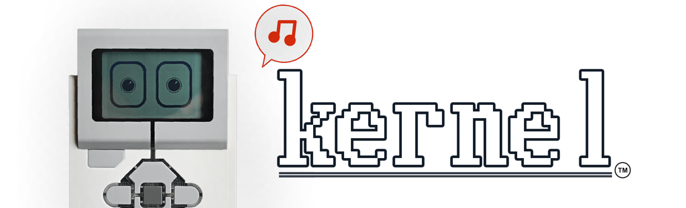
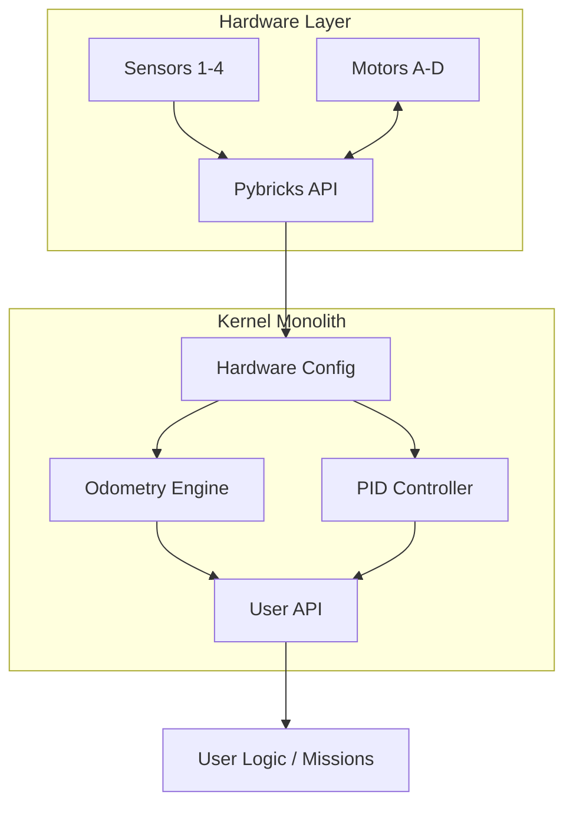
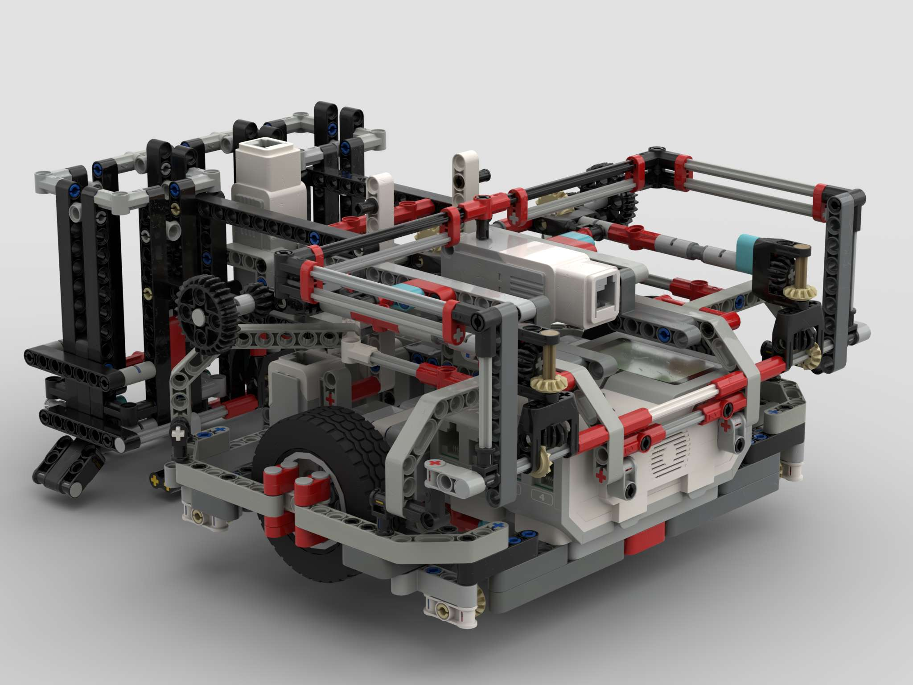
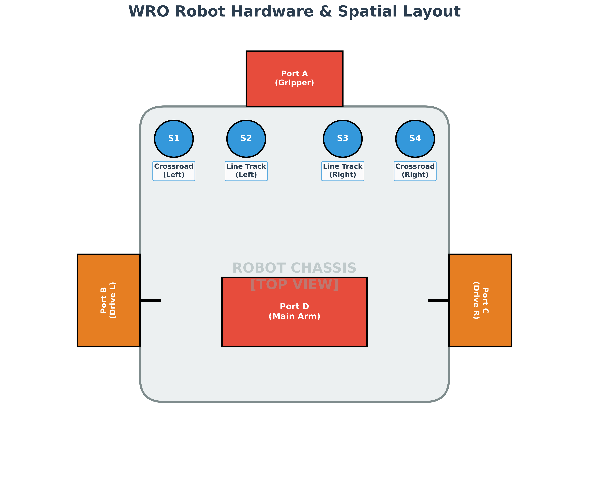
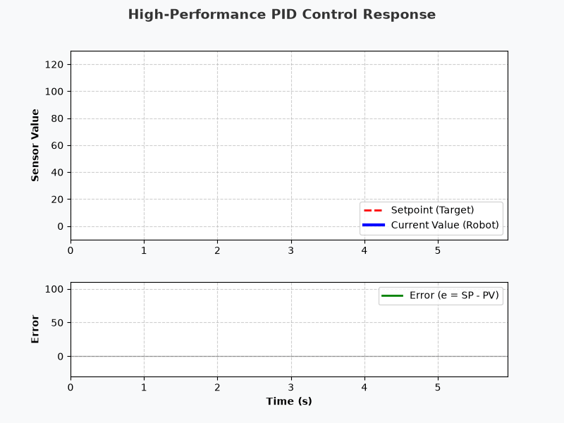
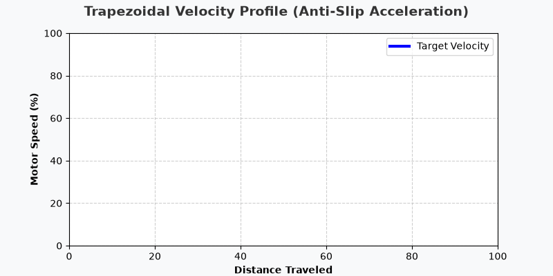
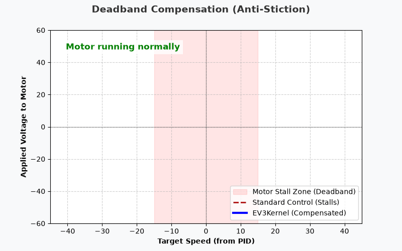
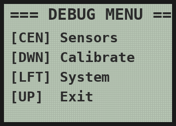

# EV3 High-Performance Robotics Kernel

<div align="center">
  
  <br><br>
  <a href="https://github.com/tiw302/ev3kernel/actions/workflows/lint.yml"></a>
  
  <a href="LICENSE"></a>
  
</div>

### Engineering Whitepaper & System Documentation

**English** | [ภาษาไทย](README_TH.md)

> [!NOTE]
> **Project Status: Active Development & LTS until 2029**
> This is not a fire-and-forget project. This kernel will be continuously refined and updated based on real-world competition experience every year until I enter university in 2029. You can expect long-term support and stability.

---

## Motivation (The Real Story)
This project was born out of 3 years of pure frustration in the World Robot Olympiad (WRO). My school had zero robotics budget, no professional coaches, and no "god-tier" code handed down by teachers. I had to learn everything from absolute scratch.

One of the most frustrating aspects of competitive robotics is the culture of knowledge restriction. Many teams keep their advanced techniques strictly confidential, and the open-source PID implementations you find online are often poorly optimized—causing inconsistent turns and unreliable straight lines. To make matters worse, the standard EV3 software is bloated, prone to crashing, and mathematically imprecise—causing the robot to behave unpredictably every single day (a massive struggle during practice that often left me completely discouraged).

Out of sheer determination, I built this kernel entirely from scratch using **[Pybricks 4.0 (beta)](https://beta.pybricks.com/)**. I spent time analyzing industrial-grade robotics repositories on GitHub (such as open-source drone flight controllers and autonomous navigation algorithms used by actual engineers). I extracted their mathematical control theories and zero-allocation memory patterns, and miniaturized them to run on this 10-year-old brick. I want to prove that even without a professional coach, a massive budget, or the newest hardware, you can build world-class, mathematically precise code. I am open-sourcing this project to break down the barriers of knowledge restriction and share these engineering techniques with independent learners who are fighting the same battle I did.

## Technical Objectives
The framework is engineered to resolve common hardware and software bottlenecks encountered in WRO competitions:
* **Elimination of Wheel Slip:** Implementation of Trapezoidal Velocity Profiles to ensure tires maintain static friction during acceleration and deceleration.
* **Deterministic Execution:** Achieving a zero-allocation hot loop to prevent Garbage Collection (GC) pauses, which typically cause 10-30ms execution stutters during line following.
* **Minimal Memory Footprint:** Consolidating the entire architecture into a highly optimized ~200KB single-file monolith to maximize available RAM for the RTOS.

---

## Table of Contents
- **Core Concepts**
  - [Hardware Requirements](#hardware-requirements)
  - [Repository Structure](#repository-structure)
  - [Quick Start](#quick-start)
  - [Navigation Theory & Mathematics](#navigation-theory--mathematics)
- **System Core**
  - [Architecture Overview](#system-architecture)
  - [Performance Optimization](#performance-optimization)
- **Navigation & Control**
  - [PIDv2 Control](#1-pidv2-proportional-integral-derivative)
  - [Line Tracking & Perception](#2-line-tracking--perception)
- **Resources**
  - [Pre-match Checklist](#pre-match-checklist)
  - [API Reference](#api-reference)

---

## Hardware Requirements
This kernel is highly optimized specifically for classic LEGO hardware following the standard WRO wiring diagram:
*   **Hub:** LEGO MINDSTORMS EV3 Brick
*   **Drive:** 2x EV3 Large Motors (Ports B & C)
*   **Attachments:** 2x EV3 Medium/Large Motors (Ports A & D)
*   **Sensor Array:** 4x EV3 Color Sensors (Ports 1, 2, 3 & 4) configured for dynamic multi-pair line tracking (e.g., using pairs 2-3 for straight tracking, and 1-2 or 3-4 for complex WRO maneuvers).

> [!TIP]
> **Are you using SPIKE Prime or Robot Inventor?**
> Modern hubs feature a built-in Gyro sensor. We highly recommend using our sister project specifically engineered for SPIKE Prime here: **[🚀 tiw302/spikekernel](https://github.com/tiw302/spikekernel)** *(Currently in active development with native Gyro Control).*

## Repository Structure
*   `main.py` - The core monolith kernel. (Copy and paste this single file to the IDE to run).
*   `debug.py` - A dashboard UI script to read and tune sensor values in real-time.
*   `generate_wiring_diagram.py` - A Python script to generate the hardware wiring diagram.

---

## Quick Start
The entire kernel is contained within a single `main.py` file to minimize RAM fragmentation and import overhead. Mission logic is written directly at the bottom of the file to comply with WRO "One-Touch" run rules.

```python
# 1. Smoothly accelerate, drive 50cm, and brake
robot.move_straight(50, max_speed=50)

# 2. Precision point-turn to exactly 90 degrees
robot.turn(90, max_speed=40)

# 3. High-speed line follow using PD control
robot.track_line(speed=40, kp=1.2, kd=0.1)
```

## System Architecture
This framework strictly adheres to a **MicroPython Monolith (Single-File) Model**. 



*   **[main.py](./main.py)**: The unified kernel. Contains hardware abstraction, math libraries, and the user-space execution block. Designed to be copy-pasted directly into the Pybricks Web IDE.
*   **[debug.py](./debug.py)**: A standalone diagnostic tool run directly on the competition mat to calibrate light sensors (Black/White), test motor functionality, and verify battery voltage via a custom on-brick UI.

---

## Hardware Configuration (Wiring)
This kernel expects a standardized hardware layout to ensure optimal geometry calculation and sensor synchronization.

<div align="center">
  <table>
    <tr>
      <td align="center"><strong>3D Robot Render</strong></td>
      <td align="center"><strong>Hardware Schematic</strong></td>
    </tr>
    <tr>
      <td></td>
      <td></td>
    </tr>
  </table>
</div>

*   **Sensors (1-4):** S2 & S3 are the primary line-tracking sensors. S1 & S4 are intersection/crossroad detectors.
*   **Motors (A-D):** B & C are the main drive motors. A & D are for grippers and lifting mechanisms.

---

## Quick Start & Installation

1. **Firmware Setup:** This kernel bypasses the stock LEGO firmware. You must install the **[Pybricks 4.0 firmware](https://beta.pybricks.com/)** on your EV3 (Installation can now be done directly via the web browser, no MicroSD card required).
2. **Execution Workflow:**
   * Write and maintain your code locally using **VS Code**.
   * When ready to run, simply copy and paste the entire code into the [Pybricks Beta Web IDE](https://beta.pybricks.com/) and execute it instantly via a USB cable. (Zero deployment overhead).
3. **Deployment:** 
   * Upload `main.py` as your primary competition script.
   * Keep `debug.py` on the brick to run hardware diagnostics and sensor calibration before official matches.

---

## API Reference

### 1. Drive & Navigation
| Function | Parameters | Description |
|---|---|---|
| `move_straight` | `distance_cm, max_speed` | Move straight using Trapezoidal velocity profiling. |
| `turn` | `target_angle, max_speed` | Point turn to a relative angle using PID control. |
| `pivot_turn` | `target_angle, pivot_side` | Pivot turn by locking one wheel (`'left'` or `'right'`). |
| `align_wall` | `power, time_ms` | Reverse into a physical wall to mechanically square the robot. |
| `stop_drive` | `hold=True/False` | Immediately brake and actively hold the wheel position. |

### 2. Line Tracking & Perception
| Function | Parameters | Description |
|---|---|---|
| `drive_until_line` | `speed, align=True` | Drive forward until a line is detected, optionally auto-squaring against it. |
| `align_line` | `time_ms` | Square the robot against a transverse black line using dual light sensors. |
| `track_line` | `speed, kp, kd` | Follows the line using PD control until an intersection is detected. |
| `track_line_distance` | `distance_cm, speed` | Follows the line using PD control for a specific distance. |
| `track_line_timer` | `time_ms, speed` | Follows the line using PD control for a specific amount of time. |
| `normalize` | `raw_value` | Maps raw light reflection to a calibrated `[0, 100]` percentage. |

### 3. Attachments & Grippers
| Function | Parameters | Description |
|---|---|---|
| `lift_a` | `speed, power` | Lift the front gripper mechanism (Port A). |
| `release_a` | *None* | Release holding torque on the front gripper. |
| `lift_d` | `speed, power` | Actuate the main lifting arm (Port D). |
| `release_d` | *None* | Release holding torque on the main arm. |

---

## Navigation Theory & Mathematics

### 1. PIDv2 (Proportional-Integral-Derivative) Control
We have engineered an advanced PID controller to overcome common EV3 shortcomings *(Source: [`main.py#L113-L168`](./main.py#L113-L168) \| Theory: [Wikipedia](https://en.wikipedia.org/wiki/Proportional%E2%80%93integral%E2%80%93derivative_controller))* :
*   **Derivative on Measurement:** Eliminates "derivative kick" when the setpoint changes suddenly.
*   **EMA Filter (Exponential Moving Average):** Smooths noisy analog signals from the EV3 color sensors before they enter the PID equation.
*   **Back-calculation Anti-windup:** Prevents integral windup accumulation during mechanical stalls.

<div align="center">
  
  <p><em>Simulation of the kernel's PID response properly tuned for stability (Error converges to 0 quickly).</em></p>
</div>

<details>
<summary><b>[+] View PIDv2 Mathematical Model</b></summary>

```text
// 1. EMA Filter for Sensor Readings
Filtered_Value = (Alpha * Raw_Value) + ((1 - Alpha) * Previous_Filtered_Value)

// 2. Derivative on Measurement (Prevents Derivative Kick)
// Uses change in process variable instead of change in error
D_Term = Kd * (Filtered_Value - Previous_Filtered_Value)

// 3. Proportional & Integral
Error = Setpoint - Filtered_Value
P_Term = Kp * Error
I_Term = I_Term + (Ki * Error)

// 4. Anti-windup (Clamping)
if (I_Term > Max_I) I_Term = Max_I;
else if (I_Term < -Max_I) I_Term = -Max_I;

Output = P_Term + I_Term - D_Term
```
</details>

### 2. Motion Profiling (Trapezoidal Velocity)
Aggressive starts cause EV3 wheels to slip, ruining heading accuracy. Our system uses a Trapezoidal S-Curve *(Source: [`main.py#L171-L197`](./main.py#L171-L197) \| Theory: [Motion Control](https://en.wikipedia.org/wiki/Motion_control))* :
*   **Accel $\rightarrow$ Cruise $\rightarrow$ Decel:** Ensures the tires maintain static friction with the competition mat at all times.

<div align="center">
  
  <p><em>Animation of the Trapezoidal Velocity Profile preventing wheel slip during acceleration and deceleration.</em></p>
</div>

<details>
<summary><b>[+] View Trapezoidal S-Curve Algorithm</b></summary>

```text
// The algorithm dynamically adjusts speed based on distance traveled (S)
if (S < Acceleration_Distance):
    // Ramp Up phase
    Speed = Min_Speed + (Max_Speed - Min_Speed) * (S / Acceleration_Distance)
else if (Total_Distance - S < Deceleration_Distance):
    // Ramp Down phase
    Speed = Min_Speed + (Max_Speed - Min_Speed) * ((Total_Distance - S) / Deceleration_Distance)
else:
    // Cruise phase
    Speed = Max_Speed
```
</details>

### 3. Deadband Compensation
EV3 Large/Medium motors suffer from internal stiction. The kernel automatically injects a minimum feedforward current to allow precise sub-millimeter movements at extremely low speeds. *(Source: [`main.py#L107-L111`](./main.py#L107-L111) \| Theory: [Deadband](https://en.wikipedia.org/wiki/Deadband))*

<div align="center">
  
  <p><em>Comparison showing how the kernel instantly breaks static friction (stiction) compared to standard PID.</em></p>
</div>

<details>
<summary><b>[+] View Feedforward Compensation Logic</b></summary>

```text
// Injects minimum power to overcome internal motor stiction
if (Target_Speed > 0):
    Output_Power = Target_Speed + Deadband_Offset
else if (Target_Speed < 0):
    Output_Power = Target_Speed - Deadband_Offset
else:
    Output_Power = 0
```
</details>

---

## Performance Optimization

### System Benchmarks
Objective architectural results achieved by abandoning standard OOP patterns in favor of a Zero-Allocation Kernel on EV3 hardware:

| Metric | Stock Software (EV3-G / Classroom) | `ev3kernel` (Pybricks) |
|---|---|---|
| **RAM Footprint** | Massive RAM usage, frequent crashes | Constant ~200KB (via `__slots__`) |
| **Control Loop** | Slow execution & inconsistent loop rate | Ultra-stable & smooth (GC-Free, ms precision) |
| **Deployment** | Heavy compilation & slow sync times | Single-file Monolith (Instant execution via Web IDE) |
| **Battery Efficiency** | High drain due to heavy stock OS overhead | Exceptional battery life (Bare-metal + Kernel optimization) |

### Zero-Allocation Hot Loops
In MicroPython, instantiating new objects (e.g., calling `print`, concatenating strings) triggers the Garbage Collector (GC), causing random 10-30ms stutters in the robot's motion. *(Source: [`main.py#L639-L689`](./main.py#L639-L689) \| Ref: [MicroPython Docs](https://docs.micropython.org/en/latest/reference/constrained.html#memory))*
* All `print()` statements are strictly banned from execution hot loops.
* Hardware methods and variables are localized (cached) to reduce CPU lookup overhead.

### Memory Optimization
The architecture uses `__slots__` within classes and `micropython.const()` for global variables to compress the RAM footprint to just ~200KB. This maximizes available memory for the RTOS to maintain stability. *(Source: [`main.py#L202`](./main.py#L202))*

### Pre-computed Mathematics
Complex mathematical operations (such as degree-to-radian conversions or gear ratios) are pre-calculated as constants during system initialization. This prevents the EV3's aging ARM9 CPU from wasting cycles recalculating the exact same values inside the hot loops.

### Non-blocking Execution
All motion logic is designed asynchronously (Non-blocking). The architecture strictly avoids `wait()` commands that would temporarily halt execution, ensuring the sensor polling rate remains at its absolute maximum frequency throughout the entire run.

---

## Pre-match Checklist

<div align="center">
  
  <p><em>The debug.py interface rendered on the EV3 brick screen for pre-match testing.</em></p>
</div>

1. Update `WHEEL_DIAMETER_MM` and `AXLE_TRACK_MM` in `main.py` to match the physical robot geometry.
2. Place the robot on the mat and run [`debug.py`](./debug.py) (Down Button) to calibrate sensors. Update `BLACK_RAW` / `WHITE_RAW` based on output.
3. Update `CENTER_OFFSET` using the dual-sensor calibration loop output.
4. Run `debug.py` (Center Button) to verify sensor readings and battery voltage before a match.

---

## Hardware Constraints & Known Limitations

In the spirit of engineering transparency, pushing 10-year-old EV3 hardware to its limits comes with physical boundaries that software cannot overcome:

1. **Battery Voltage Dependency:** The EV3 brick lacks a dedicated voltage regulator for its motor drivers. This means motor characteristics change as the battery drains. PID and Feedforward values tuned at full charge (8.4V) may perform differently at low charge (7.2V). *Recommendation: Always use a fully charged battery and verify voltage via `debug.py` before a match.*
2. **CPU & Sensor Bottleneck:** The 300MHz ARM9 processor and sensor polling protocols have inherent millisecond-level latency. Adding significantly more complex mathematics (e.g., matrix operations or heavy floating-point math) will immediately bottleneck the hardware.
3. **Memory Fragmentation Risk:** While we use `__slots__` and eliminate GC to fit within a ~200KB footprint, extending this codebase with dynamic memory allocation (like appending lists or concatenating strings) will quickly cause RAM fragmentation, leading to unpredictable crashes during a run.
4. **No Gyroscope Design:** This architecture intentionally omits the EV3 Gyro Sensor to completely bypass its infamous and unfixable hardware drift. Heading and rotation rely strictly on Motor Encoders (odometry) and dual-light sensor squaring. Consequently, maintaining absolute tire traction (clean tires) is hyper-critical.

---

## Final Note: Advice from a WRO Veteran

Even though this kernel is highly optimized, software cannot defy the laws of physics. Having experienced the intense pressure of WRO competitions myself, I want to leave you with a few practical pieces of advice:

*   **Wipe your tires constantly:** Dust is the ultimate enemy of odometry. If your tires are dusty, they will slip and your turns will be inaccurate. (Always wipe them with a damp alcohol cloth before every run).
*   **Check your cables:** The most frustrating failures often happen because a sensor cable was loose or tangled in an axle. Make cable management a habit. *(During my first year at WRO, my Gyro sensor cable disconnected in the very first round. The robot just stood there and didn't move. Don't repeat my mistake!)*
*   **Watch your battery:** If the battery voltage drops, the motors lose the torque required for the PID loops to function properly. Always keep your brick charged.
*   **Mistakes are part of the process:** On competition day, the robot might behave completely differently than it did during practice (due to lighting changes or mat friction). Don't panic, and don't blame yourself. Hardware is chaotic, and mistakes are normal. Take a deep breath and troubleshoot step by step.
*   **Simplicity is the Ultimate Sophistication:** If your system is too complex to debug during practice, it will be impossible to fix during the high-pressure environment of a match. Keep your logic as clean as possible.

Winning a robotics competition is not about having the perfect codebase; it is about **relentless practice and adaptability**. This kernel is designed to handle the software stability so you can focus entirely on mechanical design and solving the actual mission.

I hope this kernel saves your team countless hours of debugging, allowing you to focus on mission strategy and scoring. Best of luck in your robotics journey!

`[ End of Transmission ]`

---

## Useful Resources & Further Reading
* [Pybricks Official Documentation](https://docs.pybricks.com/)
* [World Robot Olympiad (WRO) Official Rules](https://wro-association.org/)
* [Understanding PID Controllers (Wikipedia)](https://en.wikipedia.org/wiki/Proportional%E2%80%93integral%E2%80%93derivative_controller)
* [Motion Control and Trapezoidal Profiles (Wikipedia)](https://en.wikipedia.org/wiki/Motion_control)

---

## ✉ Support & Contact
If you encounter any issues, your robot isn't running straight, or you have questions about PID tuning, feel free to reach out:
*   **GitHub Issues:** Feel free to open an issue in this repository.
*   **Instagram:** Send me a DM on IG at **[@tiw3025k_](https://www.instagram.com/tiw3025k_/)** *(Note: Please follow first so your message doesn't go to spam).* I'm always available to help.

---

## ✱ Contributors

| Profile | Name / GitHub | Role & Contributions |
| :---: | :--- | :--- |
|  | **[@tiw302](https://github.com/tiw302)** | **Lead Developer & Architect** <br> System architecture, mathematical implementation, and memory optimization. |
| ⏳ *(Pending GitHub)* | **[Waiting for friend to join GitHub]** | **Lead Tester & Field Engineer** <br> Field testing, PID tuning, and hardware debugging. |

---

## License
This project is licensed under the [MIT License](LICENSE) - see the [LICENSE](LICENSE) file for details.

<div align="center">
  <strong>Engineered for Victory.</strong><br>
  <em>World Robot Olympiad Competition Framework</em>
</div>
