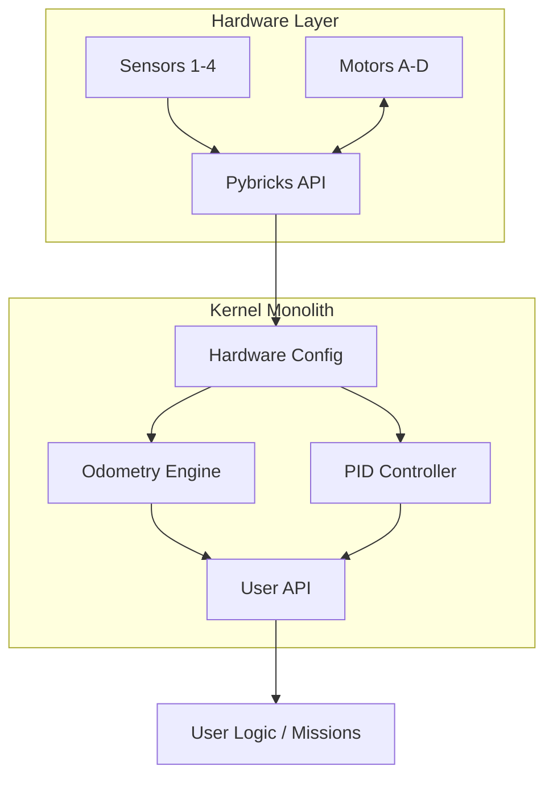
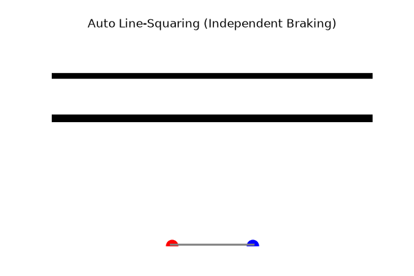

# EV3 High-Performance Robotics Kernel

<div align="center">
  
  <br><br>
  <a href="https://github.com/tiw302/ev3kernel/actions/workflows/lint.yml"></a>
  
  
  
  <a href="LICENSE"></a>
  
</div>

### เอกสารอ้างอิงทางวิศวกรรมและระบบควบคุม (Engineering Whitepaper & System Documentation)

[English](README.md) | **ภาษาไทย**

> [!NOTE]
> **Project Status: Active Development & LTS until 2029**
> โปรเจกต์นี้ไม่ได้ทำแล้วทิ้ง แต่จะถูกพัฒนาและขัดเกลาอย่างต่อเนื่องจากประสบการณ์บนสนามแข่งจริงในทุกๆ ปี จนกว่าผมจะเข้ามหาวิทยาลัยในปี 2029 (Long-Term Support) คุณจึงมั่นใจได้ว่าโค้ดชุดนี้จะได้รับการดูแลและอัปเดตอยู่เสมอคับ

---

## แรงจูงใจในการพัฒนา (Motivation: The Real Story)
โปรเจกต์นี้เกิดขึ้นจากความอัดอั้นตันใจส่วนตัวตลอด 3 ปีที่แข่ง WRO มาคับ โรงเรียนของผมไม่มีงบสนับสนุนเรื่องหุ่นยนต์ ไม่มีโค้ช ไม่มีครูที่คอยแจกโค้ดเทพๆ ให้ ผมต้องเริ่มศึกษาทุกอย่างเองจากศูนย์ 

สิ่งที่เจ็บปวดที่สุดในวงการแข่งขันคือ "วัฒนธรรมการหมกโค้ด" หลายทีมเลือกที่จะเก็บเทคนิคเชิงลึกไว้เป็นความลับ โค้ดที่มีให้โหลดตามอินเทอร์เน็ตหรือ GitHub ก็มักจะใช้งานจริงไม่ได้ (การคำนวณ PID ไม่เสถียร เลี้ยวไม่ตรง) แถมซอฟต์แวร์ EV3 รุ่นเก่าก็ทำงานช้า ชอบค้าง และทำให้หุ่นวิ่งไม่ตรงกันสักวัน (ซึ่งเป็นปัญหาที่เจอตอนซ้อมบ่อยจนทำให้ผมท้อมากๆ)

ผมจึงตัดสินใจเขียนแกนหลัก (Kernel) ของหุ่นยนต์ขึ้นมาใหม่ทั้งหมดด้วย **[Pybricks 4.0 (beta)](https://beta.pybricks.com/)** โดยผมได้ศึกษาและแกะโค้ดจากโปรเจกต์ของวิศวกรระดับอุตสาหกรรมบน GitHub (เช่น ระบบควบคุมโดรนและระบบขับเคลื่อนอัตโนมัติ) แล้วนำสมการคณิตศาสตร์และเทคนิคการจัดการหน่วยความจำระดับนั้นมาย่อส่วน (Miniaturized) ใส่ลงไปบน EV3 เพื่อพิสูจน์ว่าต่อให้ไม่มีครู ไม่มีงบ และใช้ฮาร์ดแวร์เก่า เราก็สามารถสร้างโค้ดระดับโลกที่เสถียรและแม่นยำเพื่อไปแข่งขันได้ โปรเจกต์นี้จึงเปิดเป็น Open-source เพื่อทำลายวัฒนธรรมการหมกโค้ด และแบ่งปันเทคนิคเชิงวิศวกรรมให้กับผู้ที่กำลังพยายามศึกษาด้วยตัวเองเหมือนกับผมคับ

## วัตถุประสงค์ทางเทคนิค (Technical Objectives)
ระบบถูกออกแบบมาเพื่อแก้ปัญหาคอขวดทั้งทางด้านฮาร์ดแวร์และซอฟต์แวร์ที่มักพบในการแข่งขัน WRO:
* **การลดปัญหาล้อลื่นไถล (Wheel Slip):** การใช้สมการ Trapezoidal Velocity ควบคุมการเร่งและชะลอความเร็ว เพื่อให้ยางรักษาแรงเสียดทานสถิต (Static friction) กับพื้นสนามแข่งตลอดเวลา
* **ความเสถียรในการประมวลผล (Deterministic Execution):** การออกแบบลูปการทำงานแบบ Zero-allocation เพื่อไม่ให้ระบบต้องรัน Garbage Collection (GC) ซึ่งเป็นสาเหตุให้หุ่นยนต์เกิดอาการกระตุก 10-30ms อย่างคาดเดาไม่ได้ขณะเดินตามเส้น
* **การจัดการหน่วยความจำ (Minimal Memory Footprint):** การรวมระบบทุกอย่างไว้ในไฟล์เดียว (Monolith) ที่มีการบีบอัดจนเหลือขนาดเพียง ~200KB เพื่อประหยัด RAM ให้ระบบปฏิบัติการทำงานได้เต็มประสิทธิภาพ

---

## สารบัญ (Table of Contents)
- **แนวคิดหลัก**
  - [ฮาร์ดแวร์ที่รองรับ (Hardware Requirements)](#ฮาร์ดแวร์ที่รองรับ-hardware-requirements)
  - [โครงสร้างโปรเจกต์ (Repository Structure)](#โครงสร้างโปรเจกต์-repository-structure)
  - [เริ่มต้นใช้งานด่วน (Quick Start)](#เริ่มต้นใช้งานด่วน-quick-start)
  - [หลักการทางคณิตศาสตร์และทฤษฎีการเดินรถ](#หลักการทางคณิตศาสตร์และทฤษฎีการเดินรถ)
- **ระบบควบคุมกลาง**
  - [สถาปัตยกรรมระบบ (System Architecture)](#สถาปัตยกรรมระบบ-system-architecture)
  - [การเพิ่มประสิทธิภาพ (Performance Optimization)](#การเพิ่มประสิทธิภาพ-performance-optimization)
- **การเคลื่อนที่**
  - [ระบบควบคุม PIDv2](#1-ระบบควบคุม-pidv2-proportional-integral-derivative)
  - [การเกาะเส้นและประมวลผลเซนเซอร์](#2-การเกาะเส้นและประมวลผลเซนเซอร์-line-tracking--perception)
- **ข้อมูลอ้างอิง**
  - [การเตรียมตัวก่อนแข่ง (Pre-match Checklist)](#การเตรียมตัวก่อนแข่ง-pre-match-checklist)
  - [ข้อมูลอ้างอิง API (API Reference)](#ข้อมูลอ้างอิง-api-api-reference)

---

## ฮาร์ดแวร์ที่รองรับ (Hardware Requirements)
โค้ดชุดนี้ถูกปรับแต่งแบบเจาะจง (Optimized) สำหรับฮาร์ดแวร์คลาสสิกของ LEGO ตามผัง (Wiring Diagram) ของ WRO:
*   **สมองกล:** LEGO MINDSTORMS EV3 Brick
*   **การขับเคลื่อน (Drive):** 2x EV3 Large Motors (พอร์ต B และ C)
*   **แขนกล (Attachments):** 2x EV3 Medium/Large Motors (พอร์ต A และ D)
*   **เซนเซอร์ (Sensor Array):** 4x EV3 Color Sensors (พอร์ต 1, 2, 3 และ 4) ออกแบบมาสำหรับการเกาะเส้นแบบสลับคู่ (Multi-Configuration) เช่น ใช้คู่ 2-3 สำหรับวิ่งปกติ และคู่ 1-2 หรือ 3-4 สำหรับวิ่งเก็บภารกิจเฉพาะจุด

> [!TIP]
> **ใช้ SPIKE Prime หรือ Robot Inventor อยู่ใช่ไหม?**
> ฮาร์ดแวร์ยุคใหม่มี Gyro Sensor ในตัว! ขอแนะนำให้ไปใช้โปรเจกต์คู่ขนานของผมที่ปรับแต่งมาเพื่อ SPIKE Prime โดยเฉพาะที่นี่: **[⌘ tiw302/spikekernel](https://github.com/tiw302/spikekernel)** *(กำลังอยู่ในช่วงพัฒนาและจูนระบบ Gyro Control)*

## โครงสร้างโปรเจกต์ (Repository Structure)
*   `main.py` - โค้ดแกนกลางและระบบสั่งการทั้งหมด (ก๊อปปี้ไฟล์นี้เพียงไฟล์เดียวไปใช้แข่งได้เลย)
*   `debug.py` - โปรแกรมสำหรับจำลองหน้าปัด UI เพื่ออ่านและจูนค่าเซนเซอร์
*   `generate_wiring_diagram.py` - สคริปต์ Python สำหรับสร้างแผนภาพการต่อสายไฟ (Wiring Diagram)

---

## เริ่มต้นใช้งานด่วน (Quick Start)
ระบบทั้งหมดถูกรวบรวมไว้ในไฟล์ `main.py` เพียงไฟล์เดียวเพื่อลดปัญหาคอขวดจากการใช้ RAM และเพื่อความรวดเร็วในการโหลดโมดูล การเขียนโค้ดภารกิจจะทำที่ด้านล่างสุดของไฟล์ เพื่อให้สอดคล้องกับกฎ "One-Touch" ของ WRO

```python
# 1. วิ่งตรง 50 ซม. (พร้อมระบบเร่ง/ลดความเร็วอัตโนมัติ)
robot.move_straight(50, max_speed=50)

# 2. เลี้ยว 90 องศา ด้วยระบบควบคุมความแม่นยำ PID
robot.turn(90, max_speed=40)

# 3. เดินตามเส้นดำด้วยระบบควบคุมแบบ PD
robot.track_line(speed=40, kp=1.2, kd=0.1)
```

---

## สถาปัตยกรรมระบบ (System Architecture)
เฟรมเวิร์กนี้ยึดหลักการออกแบบแบบ **MicroPython Monolith (Single-File)** 



*   **[main.py](./main.py)**: แกนหลักของระบบ (Kernel) รวมฟังก์ชันการควบคุมฮาร์ดแวร์ คณิตศาสตร์ และลอจิกภารกิจไว้ในที่เดียว ออกแบบมาให้คัดลอกและวางเพื่อรันบน Pybricks Web IDE ได้ทันที
*   **[debug.py](./debug.py)**: สคริปต์เครื่องมือสำหรับตรวจสอบสถานะหุ่นยนต์ ใช้สำหรับคาลิเบรตเซนเซอร์แสง เช็คแบตเตอรี่ และอ่านค่าเอนโค้ดเดอร์ก่อนเริ่มแข่งขัน

---

## การเชื่อมต่อฮาร์ดแวร์ (Hardware Configuration)
เพื่อความแม่นยำในการคำนวณ Odometry และจังหวะการเลี้ยว หุ่นยนต์ควรต่อสายตามมาตรฐานที่ Kernel นี้กำหนดไว้:

<div align="center">
  <table>
    <tr>
      <td align="center"><strong>3D Robot Render</strong></td>
      <td align="center"><strong>Hardware Schematic</strong></td>
    </tr>
    <tr>
      <td></td>
      <td></td>
    </tr>
  </table>
</div>

*   **พอร์ตเซนเซอร์ (1-4):** S2 & S3 คือเซนเซอร์หลักสำหรับเดินตามเส้น (Line Tracking). S1 & S4 คือเซนเซอร์เช็คทางแยก (Crossroad).
*   **พอร์ตมอเตอร์ (A-D):** B & C คือมอเตอร์ขับเคลื่อน (Drive). A & D คือมอเตอร์แขนกล (Attachments).

---

## การติดตั้งและใช้งานเบื้องต้น (Quick Start)

1. **เตรียมเฟิร์มแวร์:** โปรเจกต์นี้ไม่ได้ใช้เฟิร์มแวร์มาตรฐานของ LEGO คุณต้องแฟลชเฟิร์มแวร์ **[Pybricks 4.0](https://beta.pybricks.com/)** ลงบน EV3 ของคุณ (สามารถติดตั้งผ่านเว็บบราวเซอร์ได้โดยตรง ไม่ต้องใช้ MicroSD Card แล้ว)
2. **Workflow การเขียนโค้ด:** 
   * โค้ดทั้งหมดถูกออกแบบมาให้คุณเปิดและแก้ไขผ่านโปรแกรม **VS Code** ในคอมพิวเตอร์ของคุณ
   * เมื่อพร้อมทดสอบ ให้คัดลอก (Copy) โค้ดทั้งหมดไปวางใน [Pybricks Beta Web IDE](https://beta.pybricks.com/) แล้วกดรันผ่านสาย USB ได้ทันที (เป็นวิธีที่รวดเร็วที่สุด ไม่ต้องรอการดีพลอยไฟล์)
3. **การนำไปใช้งาน:** 
   * นำไฟล์ `main.py` ไปรันเป็นไฟล์หลักสำหรับภารกิจการแข่งขัน
   * โหลดไฟล์ `debug.py` ติดเครื่องไว้ เพื่อใช้รันตรวจสอบความพร้อมของเซนเซอร์ก่อนลงสนามแข่ง

---

## ข้อมูลอ้างอิง API (API Reference)

### 1. การเคลื่อนที่พื้นฐาน (Drive & Navigation)
| ฟังก์ชัน | พารามิเตอร์ | คำอธิบาย |
|---|---|---|
| `move_straight` | `distance_cm, max_speed` | วิ่งตรงโดยใช้สมการความเร็วแบบกราฟคางหมู (Trapezoidal) |
| `turn` | `target_angle, max_speed` | หมุนตัวอยู่กับที่ (Point turn) ตามองศาที่กำหนดด้วย PID |
| `pivot_turn` | `target_angle, pivot_side` | เลี้ยววงกว้างโดยล็อกล้อข้างใดข้างหนึ่ง (`'left'` หรือ `'right'`) |
| `align_wall` | `power, time_ms` | วิ่งถอยชนกำแพงเพื่อจัดระเบียบหุ่นยนต์ (Mechanical squaring) |
| `stop_drive` | `hold=True/False` | สั่งเบรกฉุกเฉินและล็อกมอเตอร์ให้อยู่กับที่ |

### 2. การเกาะเส้นและประมวลผลเซนเซอร์ (Line Tracking & Perception)
| ฟังก์ชัน | พารามิเตอร์ | คำอธิบาย |
|---|---|---|
| `drive_until_line` | `speed, align=True` | วิ่งตรงไปหาเส้นดำ และสามารถสั่งให้เทียบเส้นอัตโนมัติได้เมื่อเจอ |
| `align_line` | `time_ms` | ใช้เซนเซอร์แสงคู่เพื่อเทียบเส้นดำทางขวางให้ตั้งฉากกับเส้น |
| `track_line` | `speed, kp, kd` | วิ่งตามขอบเส้นดำด้วยระบบ PD จนกว่าจะเจอทางแยกตัดขวาง |
| `track_line_distance` | `distance_cm, speed` | วิ่งเกาะเส้นด้วยระบบ PD จนกว่าจะได้ระยะทาง (ซม.) ที่กำหนด |
| `track_line_timer` | `time_ms, speed` | วิ่งเกาะเส้นด้วยระบบ PD จนกว่าจะหมดเวลา (มิลลิวินาที) ที่กำหนด |
| `normalize` | `raw_value` | แปลงค่าแสงดิบให้กลายเป็นเปอร์เซ็นต์ `[0, 100]` ตามค่าที่คาลิเบรตไว้ |

### 3. การควบคุมอุปกรณ์เสริม (Attachments & Grippers)
| ฟังก์ชัน | พารามิเตอร์ | คำอธิบาย |
|---|---|---|
| `lift_a` | `speed, power` | สั่งงานมอเตอร์ชุดยก/หนีบด้านหน้า (พอร์ต A) |
| `release_a` | *ไม่มี* | ปล่อยโหลดกระแสไฟที่มอเตอร์ A เพื่อพักมอเตอร์ |
| `lift_d` | `speed, power` | สั่งงานมอเตอร์แขนยกชุดใหญ่ (พอร์ต D) |
| `release_d` | *ไม่มี* | ปล่อยโหลดกระแสไฟที่มอเตอร์ D |

---

## หลักการทางคณิตศาสตร์และทฤษฎีการเดินรถ

### 1. ระบบควบคุม PIDv2 (Proportional-Integral-Derivative)
เราได้พัฒนาระบบ PID ขั้นสูงเพื่อป้องกันข้อผิดพลาดที่มักเกิดในหุ่นยนต์ทั่วไป โดยใช้เทคนิค **Inlining** ฝังสมการลงในฟังก์ชันขับเคลื่อนโดยตรง (เช่น `move_straight`) เพื่อลดภาระ CPU (Zero-Allocation) และทำให้หุ่นทำงานได้ที่ความถี่ 1,000Hz *(ทฤษฎี: [Wikipedia](https://en.wikipedia.org/wiki/Proportional%E2%80%93integral%E2%80%93derivative_controller))* :
*   **Derivative on Measurement (Inlined):** ป้องกันอาการกระตุกรุนแรง (Derivative kick) เมื่อเป้าหมายเปลี่ยนกะทันหัน
*   **EMA Filter (Inlined):** กรองสัญญาณรบกวน (Noise) จากเซนเซอร์แสง EV3 ก่อนนำไปคำนวณ
*   **Back-calculation Anti-windup (Inlined):** ป้องกันไม่ให้ค่า Integral สะสมตัวจนล้นเมื่อมอเตอร์เกิดอาการติดขัด

<div align="center">
  
  <p><em>ภาพจำลองการตอบสนองของระบบ PID ภายใน Kernel ที่ทำการจูนจนเสถียร (Error ลู่เข้าหา 0 อย่างรวดเร็ว)</em></p>
</div>

<details>
<summary><b>[+] ดูสมการคณิตศาสตร์ที่ใช้ใน PIDv2</b></summary>

```text
// 1. EMA Filter สำหรับอ่านค่าเซนเซอร์
Filtered_Value = (Alpha * Raw_Value) + ((1 - Alpha) * Previous_Filtered_Value)

// 2. Derivative on Measurement (ป้องกัน Derivative Kick)
// ไม่ใช้ (Error - Prev_Error) แต่ใช้ผลต่างของค่าเซนเซอร์แทน
D_Term = Kd * (Filtered_Value - Previous_Filtered_Value)

// 3. Proportional & Integral
Error = Setpoint - Filtered_Value
P_Term = Kp * Error
I_Term = I_Term + (Ki * Error)

// 4. Anti-windup (Clamping)
if (I_Term > Max_I) I_Term = Max_I;
else if (I_Term < -Max_I) I_Term = -Max_I;

Output = P_Term + I_Term - D_Term
```
</details>

### 2. Motion Profiling (Trapezoidal Velocity)
การออกตัวกระชากทำให้ล้อ EV3 ลื่นไถลและองศาเพี้ยน ระบบของเราใช้สมการ S-Curve แบบกราฟคางหมู *(อ้างอิงโค้ด: [`main.py#L171-L197`](./main.py#L171-L197) \| ทฤษฎี: [Motion Control](https://en.wikipedia.org/wiki/Motion_control))* :
*   **เร่งความเร็ว $\rightarrow$ คงความเร็ว $\rightarrow$ ชะลอความเร็ว:** มั่นใจได้ว่าหน้ายางจะเกาะพื้นสนามแข่งขันตลอดเวลา

<div align="center">
  
  <p><em>กราฟแสดงการทำงานของสมการ Trapezoidal Velocity เพื่อลดอาการล้อฟรีตอนออกตัวและลื่นไถลตอนเบรก</em></p>
</div>

<details>
<summary><b>[+] ดูอัลกอริทึม Trapezoidal S-Curve</b></summary>

```text
// อัลกอริทึมจะคำนวณความเร็วเป้าหมายตามระยะทางที่วิ่งไปแล้ว (S)
if (S < Acceleration_Distance):
    // ช่วงเร่งความเร็ว (Ramp Up)
    Speed = Min_Speed + (Max_Speed - Min_Speed) * (S / Acceleration_Distance)
else if (Total_Distance - S < Deceleration_Distance):
    // ช่วงชะลอความเร็ว (Ramp Down)
    Speed = Min_Speed + (Max_Speed - Min_Speed) * ((Total_Distance - S) / Deceleration_Distance)
else:
    // ช่วงความเร็วคงที่ (Cruise)
    Speed = Max_Speed
```
</details>

### 3. Deadband Compensation
มอเตอร์ขนาดกลาง/ใหญ่ของ EV3 มักมีแรงเสียดทานภายใน (Stiction) ระบบจะทำการจ่ายกระแสไฟขั้นต่ำ (Feedforward) ชดเชยเข้าไปอัตโนมัติเพื่อให้หุ่นยนต์ขยับตัวในความเร็วต่ำได้อย่างแม่นยำ *(อ้างอิงโค้ด: [`main.py#L107-L111`](./main.py#L107-L111) \| ทฤษฎี: [Deadband](https://en.wikipedia.org/wiki/Deadband))*

<div align="center">
  
  <p><em>กราเปรียบเทียบระหว่างมอเตอร์ทั่วไป (ค้างที่ความเร็วต่ำ) และระบบที่ถูกชดเชยแรงเสียดทานแล้ว (ขยับทันที)</em></p>
</div>

<details>
<summary><b>[+] ดูสมการ Feedforward Compensation</b></summary>

```text
// ชดเชยแรงเสียดทานเมื่อมอเตอร์ต้องหมุนด้วยความเร็วต่ำมากๆ
if (Target_Speed > 0):
    Output_Power = Target_Speed + Deadband_Offset
else if (Target_Speed < 0):
    Output_Power = Target_Speed - Deadband_Offset
else:
    Output_Power = 0
```
</details>

### 4. การตั้งลำและจัดระเบียบหุ่นอัตโนมัติ (Auto-Squaring & Synchronization)
เพื่อแก้ปัญหาการวางหุ่นเอียง หรือการสะสมค่าความคลาดเคลื่อนกลางสนาม เราใช้เทคนิคการซิงค์มอเตอร์เพื่อรีเซ็ตองศา (Heading Reset):
*   **Wall Squaring (ชนกำแพงตั้งลำ):** ใช้ P-Controller ควบคุมค่าองศาล้อ (Encoder) ซ้ายและขวาให้เท่ากันตลอดเวลาขณะขับชนกำแพง (`sync_err = left_angle - right_angle`) ป้องกันไม่ให้หุ่นบิดตัวเมื่อเกิดอาการมอเตอร์หยุดชะงัก (Stall)
*   **Line Squaring (จัดหน้ากระดานด้วยเส้นขวาง):** อ่านเซ็นเซอร์สีซ้าย-ขวาอย่างเป็นอิสระต่อกัน ล้อข้างที่เซ็นเซอร์เจอเส้นดำก่อนจะหยุดและล็อกทันที ในขณะที่ล้ออีกข้างจะหมุนต่อไปจนกว่าจะเจอเส้น ทำให้หุ่นปรับหน้ากระดานตั้งฉากกับเส้นแบบ 100% กลางสนาม

<div align="center">
  
  <p><em>กราฟจำลองการทำ Line Squaring ล้อซ้ายชนเส้นและเบรกก่อน ปล่อยล้อขวาเดินต่อจนกว่าหุ่นจะขนานกับเส้นขวาง</em></p>
</div>

<details>
<summary><b>[+] ดูลอจิก P-Controller การชนกำแพงและเบรกอิสระ</b></summary>

```text
// 1. Proportional Wall Squaring
sync_error = Left_Motor_Angle - Right_Motor_Angle
correction = Kp * sync_error
Left_Motor_Power = Base_Power - correction
Right_Motor_Power = Base_Power + correction

// 2. Independent Line Squaring
if (Left_Sensor_Sees_Black)  -> Stop Left Motor
if (Right_Sensor_Sees_Black) -> Stop Right Motor
```
</details>

---

## การเพิ่มประสิทธิภาพ (Performance Optimization)

### System Benchmarks
เพื่อหลีกเลี่ยงการโฆษณาเกินจริง นี่คือผลลัพธ์ทางสถาปัตยกรรม (Architectural Results) ที่พิสูจน์ได้จากการทิ้งโครงสร้างปกติ แล้วหันมาใช้ Zero-Allocation Kernel บนฮาร์ดแวร์ EV3:

| Metric | ซอฟต์แวร์ดั้งเดิม (EV3-G / Classroom) | `ev3kernel` (Pybricks) |
|---|---|---|
| **RAM Footprint** | กิน RAM มหาศาล เสี่ยงโปรแกรมค้างบ่อย | คงที่ที่ ~200KB (บีบอัดผ่าน `__slots__`) |
| **Control Loop** | ทำงานช้า (Lag) และความถี่ลูปไม่คงที่ | เสถียรและราบรื่นระดับ Millisecond (ปราศจาก GC Spikes) |
| **Deployment** | รอคอมไพล์และซิงค์โปรแกรมนานมาก | Monolith ไฟล์เดียว (รันโค้ดผ่านเว็บได้ทันทีระดับวินาที) |
| **Battery Efficiency** | แบตหมดไวเพราะรันบน OS ที่หนัก (Linux) | ประหยัดแบตขั้นสุด (รันบน Bare-metal + โค้ดรีดประสิทธิภาพ) |

### Zero-Allocation Hot Loops & Deterministic GC
ในระบบ MicroPython การสร้างออบเจกต์ใหม่ (เช่น การใช้คำสั่ง `print` หรือการต่อ String) จะไปกระตุ้นระบบกำจัดขยะ (Garbage Collector) ซึ่งทำให้เกิดอาการ CPU ค้างชั่วขณะ (Jitter ประมาณ 5-10 มิลลิวินาที) ส่งผลให้หุ่นยนต์กระตุกแบบสุ่มขณะวิ่งหรือเกาะเส้น *(อ้างอิง: [MicroPython Docs](https://docs.micropython.org/en/latest/reference/constrained.html#memory))*

*   คำสั่ง `print()` ทั้งหมดถูกกวาดล้างออกจากลูปการทำงานหลัก (Hot loops) อย่างเด็ดขาด
*   เก็บค่าตัวแปรและ Method ของฮาร์ดแวร์ไว้ในหน่วยความจำ Cache เพื่อลดภาระของ CPU
*   **Zero-Jitter Control:** เราควบคุม Garbage Collector แบบเบ็ดเสร็จ โดยสั่งล้างขยะล่วงหน้าและปิดการกำจัดขยะชั่วคราว (`gc.collect()` และ `gc.disable()`) ก่อนเข้าสู่ Hot Loop เพื่อให้ Control Loop ทำงานได้เต็มประสิทธิภาพที่ 1,000Hz โดยปราศจากอาการสะดุด 100%

### Memory Optimization
ใช้โครงสร้าง `__slots__` ในคลาส และใช้ `micropython.const()` ในการกำหนดตัวแปร เพื่อบีบอัดการใช้ RAM ให้เหลือเพียง ~200KB ซึ่งช่วยเพิ่มพื้นที่ว่างให้ระบบปฏิบัติการ (RTOS) ทำงานได้เสถียรที่สุด *(อ้างอิงโค้ด: [`main.py#L202`](./main.py#L202))*

### Pre-computed Mathematics
การคำนวณสมการคณิตศาสตร์ที่ซับซ้อน (เช่น การแปลงองศาเป็นเรเดียน หรืออัตราทดเกียร์) จะถูกคำนวณให้เสร็จเป็นค่าคงที่ (Constant) ตั้งแต่ตอน Setup ระบบ เพื่อป้องกันไม่ให้ CPU ARM9 รุ่นเก่าของ EV3 ต้องเสียเวลาคูณหารเลขเดิมๆ ซ้ำๆ ภายในลูปควบคุมหลัก

### Non-blocking Execution
ลอจิกการเคลื่อนที่ทั้งหมดถูกออกแบบแบบไม่บล็อกการทำงาน (Non-blocking) โดยหลีกเลี่ยงการใช้คำสั่ง `wait()` ที่จะทำให้ระบบหยุดชะงัก เพื่อให้วงรอบการอ่านค่าเซนเซอร์ (Polling rate) ทำงานได้รวดเร็วและมีความถี่สูงสุดตลอดเวลา

---

## การเตรียมตัวก่อนแข่ง (Pre-match Checklist)

<div align="center">
  
  <p><em>หน้าจอ Interface ของ debug.py บนหน้าจอ EV3 สำหรับใช้ทดสอบก่อนแข่ง</em></p>
</div>

1. แก้ไขค่า `WHEEL_DIAMETER_MM` และ `AXLE_TRACK_MM` ในไฟล์ `main.py` ให้ตรงกับขนาดจริงของหุ่นยนต์
2. นำหุ่นยนต์ไปวางบนสนามจริง แล้วรัน [`debug.py`](./debug.py) (กดปุ่มล่าง) เพื่อคาลิเบรต และนำค่าที่ได้มาใส่ในตัวแปร `BLACK_RAW` / `WHITE_RAW`
3. แก้ไขค่า `CENTER_OFFSET` ที่ได้จากลูปการคาลิเบรตเซนเซอร์คู่
4. รัน `debug.py` (กดปุ่มกลาง) เพื่อตรวจสอบความถูกต้องของเซนเซอร์และสถานะแบตเตอรี่ก่อนลงแข่ง

---

## ข้อจำกัดของฮาร์ดแวร์ (Known Limitations)

ด้วยความสัตย์จริง การรีดประสิทธิภาพฮาร์ดแวร์อายุ 10 กว่าปีอย่าง EV3 ย่อมมีขีดจำกัดทางกายภาพที่ซอฟต์แวร์ไม่สามารถก้าวข้ามได้:

1. **Battery Voltage Dependency (ปัญหาไฟตก):** สมองกล EV3 ไม่มีระบบปรับแรงดันไฟ (Voltage Regulator) สำหรับมอเตอร์ หมายความว่าเมื่อแบตเตอรี่อ่อนลง พฤติกรรมของมอเตอร์จะเปลี่ยนไป ค่า PID และ Feedforward ที่จูนไว้ตอนแบตเต็ม (8.4V) อาจจะทำงานเพี้ยนตอนแบตอ่อน (7.2V) *คำแนะนำ: ชาร์จแบตเตอรี่ให้เต็ม และใช้ `debug.py` เช็คแรงดันไฟก่อนลงสนามทุกครั้ง*
2. **CPU & Sensor Bottleneck:** หน่วยประมวลผล ARM9 (300MHz) และโปรโตคอลการอ่านเซนเซอร์ของ EV3 มีความหน่วง (Latency) ในตัวเอง การเพิ่มสมการคณิตศาสตร์ที่หนักหน่วงไปกว่านี้ (เช่น Matrix Operations) จะทำให้เกิดคอขวดที่ฮาร์ดแวร์ทันที
3. **Memory Fragmentation Risk:** แม้เราจะล็อกการใช้ RAM ด้วย `__slots__` และเลี่ยง GC อย่างเด็ดขาดแล้ว แต่ถ้าผู้ใช้นำไปเขียนโค้ดต่อยอดโดยสร้างตัวแปรแบบ Dynamic (เช่น การต่อ String ในลูป) ระบบจะเกิด Memory Fragmentation อย่างรวดเร็วและทำให้หุ่นยนต์ค้างระหว่างแข่งได้
4. **No Gyroscope Used:** โครงสร้างนี้ออกแบบมาให้ใช้แค่ เซนเซอร์แสง 2 ตัว และ Motor Encoders เท่านั้น โดยจงใจตัด Gyro Sensor ทิ้งเพื่อตัดปัญหา Gyro Drift ที่แก้ไม่หายของ EV3 การเลี้ยวและการรักษาองศาจึงพึ่งพาสมการ Odometry และแรงเสียดทานของล้อเป็นหลัก (ซึ่งเสี่ยงต่อการลื่นไถลหากล้อยางมีฝุ่นเกาะ)

---

## บทส่งท้าย: คำแนะนำจากรุ่นพี่ WRO (A Note from a Veteran)

แม้ว่า Kernel ตัวนี้จะถูกรีดประสิทธิภาพทางซอฟต์แวร์จนถึงขีดสุด แต่มันก็ไม่สามารถเอาชนะ "ฟิสิกส์" ได้คับ ในฐานะคนที่เคยผ่านความกดดันบนสนามแข่งมาก่อน ผมขอฝากข้อเตือนใจเล็กๆ น้อยๆ ไว้ให้:

*   **เช็ดล้อทุกครั้งก่อนปล่อยหุ่น:** ฝุ่นคือศัตรูตัวฉกาจของการเลี้ยวแบบคำนวณองศา ถ้าล้อยางมีฝุ่นเกาะ หุ่นจะลื่นไถลและเลี้ยวเพี้ยนทันที (แนะนำให้ใช้ผ้าชุบแอลกอฮอล์หมาดๆ เช็ดล้อก่อนรันเสมอ)
*   **เสียบสายให้แน่น จัดระเบียบให้ดี:** เรื่องตลกที่ขำไม่ออกที่สุดคือหุ่นรวนเพราะสายเซนเซอร์หลวม หรือสายร่วงไปขัดกับเพลามอเตอร์ เช็คจุดนี้ให้เป็นนิสัยคับ *(ปีแรกที่ผมแข่ง WRO ผมตกม้าตายเพราะสาย Gyro หลุดตอนแข่งรอบแรก ทำให้หุ่นยืนนิ่งไม่เดินไปไหนเลย... อย่าพลาดแบบผมนะ)*
*   **ระวังเรื่องแบตเตอรี่:** ถ้าไฟอ่อน มอเตอร์จะไม่มีแรงพอให้ระบบ PID ทำงานได้สมบูรณ์ หมั่นเช็คโวลต์ผ่านโหมด Debug และชาร์จแบตเตอรี่ให้เต็มอยู่เสมอ
*   **ความผิดพลาดคือเรื่องปกติ:** วันแข่งจริง หุ่นอาจจะวิ่งไม่เหมือนตอนซ้อมเลยก็ได้ (เช่น แสงไฟในฮอลล์เปลี่ยน, โต๊ะฝืดไม่เท่ากัน) ไม่ต้องตกใจและไม่ต้องโทษตัวเองคับ ความผิดพลาดคือส่วนหนึ่งของการแข่งขัน ค่อยๆ หายใจลึกๆ แล้วแก้ปัญหาหน้างานไปทีละจุด

แชมป์เปี้ยนไม่ได้เกิดจากการมีโค้ดที่เทพที่สุด แต่เกิดจาก **"การซ้อมที่เยอะกับการไม่ยอมแพ้"** โค้ดชุดนี้สร้างมาเพื่อแบ่งเบาความปวดหัวเรื่องซอฟต์แวร์รวน เพื่อให้คุณมีเวลาไปโฟกัสกับการออกแบบหุ่นและการแก้ปัญหาบนสนามได้อย่างเต็มที่

ขอให้สนุกกับการซ้อม ผิดพลาดให้เยอะๆ เรียนรู้ให้หนักๆ และโชคดีกับการแข่งขันคับ!

`[ End of Transmission ]`

---

## ✉ สอบถามปัญหาและพูดคุย (Support & Contact)
หากนำโค้ดไปใช้แล้วติดปัญหา หุ่นวิ่งไม่ตรง หรือมีข้อสงสัยเกี่ยวกับการจูนค่า PID สามารถติดต่อผมได้โดยตรงคับ:
*   **เปิด Issue:** สามารถกดสร้าง Issue ไว้ใน GitHub ได้เลยคับ
*   **Instagram:** ทักมาคุยได้นะคับที่ IG: **[@tiw3025k_](https://www.instagram.com/tiw3025k_/)** *(รบกวนกดติดตามก่อนทักนะคับ ถึงจะเห็นข้อความ)* ว่างตอบตลอดคับ ทักมาถามได้เลย

---

## ✱ ผู้ร่วมพัฒนา (Contributors)

| Profile | Name / GitHub | Role & Contributions |
| :---: | :--- | :--- |
|  | **[@tiw302](https://github.com/tiw302)** | **Lead Developer & Architect** <br> ออกแบบสถาปัตยกรรม Kernel, เขียนสมการคณิตศาสตร์ และรีดประสิทธิภาพ (Optimization) |
| ⏳ *(รอสมัคร GitHub)* | **[รอเพื่อนสมัคร GitHub]** | **Lead Tester & Field Engineer** <br> นำรหัสไปทดสอบบนสนามจริง, ปรับจูนค่า PID และช่วยเช็คบั๊กของฮาร์ดแวร์ |

---

## แหล่งข้อมูลเพิ่มเติมสำหรับการศึกษา (Useful Resources)
* [Pybricks Official Documentation](https://docs.pybricks.com/)
* [World Robot Olympiad (WRO) Official Rules](https://wro-association.org/)
* [ทำความเข้าใจระบบ PID Controller (Wikipedia)](https://en.wikipedia.org/wiki/Proportional%E2%80%93integral%E2%80%93derivative_controller)
* [ทฤษฎีการควบคุมการเคลื่อนที่ และ Trapezoidal Profile (Wikipedia)](https://en.wikipedia.org/wiki/Motion_control)

---

## สัญญาอนุญาต (License)
โปรเจกต์นี้แจกจ่ายภายใต้สัญญาอนุญาตแบบ [MIT License](LICENSE) - ดูรายละเอียดเพิ่มเติมได้ในไฟล์ [LICENSE](LICENSE)

<div align="center">
  <strong>Engineered for Victory.</strong><br>
  <em>World Robot Olympiad Competition Framework</em>
</div>
