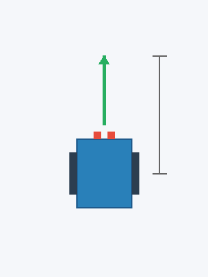
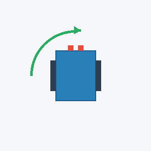
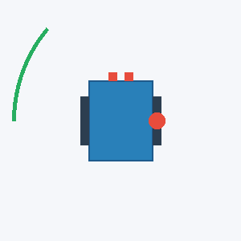
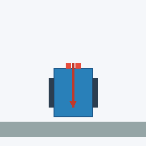
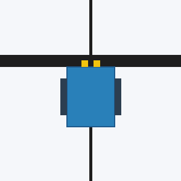
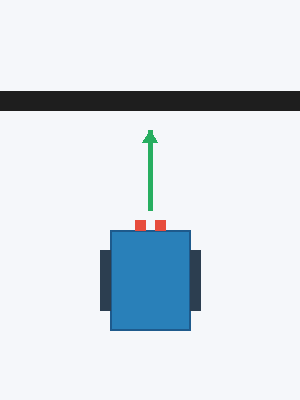
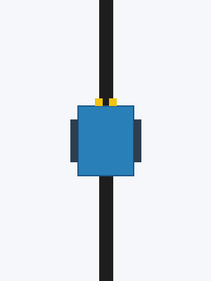
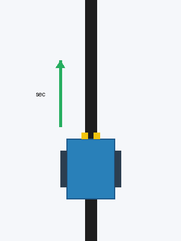
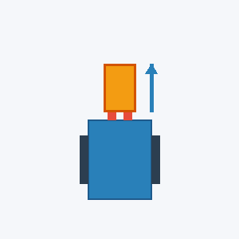

# EV3Kernel - API Reference

Documentation for building Mission Scripts with the Robot class.

---

## 1. KINEMATICS & ODOMETRY

<details>
<summary><b>[+] <code>move_straight(distance_cm, max_speed=50)</code></b></summary>



Drives the robot straight forward or backward. Uses a Closed-loop PID controller to ensure both wheels stay perfectly synchronized, preventing drift.

**Parameters:**
- `distance_cm` (float): Target distance (cm). Positive = Forward, Negative = Backward.
- `max_speed` (int): Maximum top speed (0-100%).

**Example:**
```python
# Drive forward 50 cm at 60% speed
robot.move_straight(50, max_speed=60)

# Drive backward 20 cm at 40% speed
robot.move_straight(-20, max_speed=40)
```
</details>

<details>
<summary><b>[+] <code>turn(angle_deg, max_speed=40)</code></b></summary>



Executes a point turn by rotating the left and right wheels in opposite directions. PID controlled for precise rotation.

**Parameters:**
- `angle_deg` (float): Target angle (Positive = Turn Right, Negative = Turn Left).
- `max_speed` (int): Maximum turning speed (0-100%).

**Example:**
```python
# Turn right 90 degrees
robot.turn(90, max_speed=40)

# Turn left 45 degrees
robot.turn(-45, max_speed=30)
```
</details>

<details>
<summary><b>[+] <code>pivot_turn(angle_deg, pivot_side, max_speed=40)</code></b></summary>



Performs a wide pivot turn by locking one wheel as an anchor and driving the other wheel to sweep.

**Parameters:**
- `angle_deg` (float): Target angle (Positive = Fwd Right / Back Left, Negative = Fwd Left / Back Right).
- `pivot_side` (str): Anchor wheel (`'left'` or `'right'`).
- `max_speed` (int): Maximum speed (0-100%).

**Example:**
```python
# Lock right wheel, sweep left wheel forward for a 90-deg right turn
robot.pivot_turn(90, pivot_side='right', max_speed=40)

# Lock left wheel, sweep right wheel backward for a 45-deg left turn
robot.pivot_turn(-45, pivot_side='left', max_speed=30)
```
</details>

---

## 2. ALIGNMENT & HOMING

<details>
<summary><b>[+] <code>align_wall(power=-50, time_sec=1.5)</code></b></summary>



Reverses the robot into a physical wall to mechanically square its chassis. Uses PWM limiting to prevent gear stripping during the stall.

**Parameters:**
- `power` (int): Raw duty cycle applied (Positive = Forward, Negative = Backward). Negative value is recommended.
- `time_sec` (float): Push duration in seconds.

**Example:**
```python
# Push backward into a wall for 1.5 seconds to align
robot.align_wall(power=-50, time_sec=1.5)
```
</details>

<details>
<summary><b>[+] <code>align_line(speed=30, target_val=15, kp=1.0, time_sec=1.0, hold=True)</code></b></summary>



Squares the robot using a Pro 3-Step technique:
1. Approaches the line at `speed`.
2. The first wheel to hit the line holds while the other catches up.
3. Perfects the perpendicular alignment using independent PID edge locking.

**Parameters:**
- `speed` (int): Approach speed to search for the line. Set to 0 if already on the line.
- `target_val` (int): Target edge threshold light value.
- `kp` (float): Corrective force gain.
- `time_sec` (float): Timeout duration for the PID lock in seconds.
- `hold` (bool): Active hold the motors after alignment.
- `left_sensor` (str): Left sensor port (default "2").
- `right_sensor` (str): Right sensor port (default "3").

**Example:**
```python
# Approach at speed 30 and lock edge for 1 second
robot.align_line(speed=30, time_sec=1.0)
```
</details>

---

## 3. SENSOR FUSION & LINE TRACKING (333Hz)

<details>
<summary><b>[+] <code>drive_until_line(speed=40, align=True, left_sensor="2", right_sensor="3")</code></b></summary>



Drives straight forward until both sensors detect a transverse black line (intersection).

**Parameters:**
- `speed` (int): Movement speed.
- `align` (bool): If True, automatically calls `align_line()` upon detection.
- `left_sensor` (str): Left sensor port (default "2").
- `right_sensor` (str): Right sensor port (default "3").

**Example:**
```python
# Drive until line and auto-square the robot
robot.drive_until_line(speed=40, align=True)

# Use edge sensors (ports 1 and 4)
robot.drive_until_line(speed=40, left_sensor="1", right_sensor="4")
```
</details>

<details>
<summary><b>[+] <code>track_line(speed=None, kp=None, ki=None, kd=None, left_sensor="2", right_sensor="3")</code></b></summary>



Straddles a black line continuously until an intersection is detected. Features a Dynamic Base Speed algorithm that slows the robot down on sharp curves.

**Parameters:**
- Values are automatically loaded from `TRACK_LINE_CFG` in `config.py`.
- `speed` (int, optional): Driving speed (0-100%). Overrides the config default.
- `kp`, `ki`, `kd` (float, optional): PID constants for fine-tuning. Overrides the config default.
- `left_sensor` (str): Left sensor port (default "2").
- `right_sensor` (str): Right sensor port (default "3").

**Example:**
```python
# Track line using the defaults defined in TRACK_LINE_CFG
robot.track_line()

# Track line using ports 1 and 2
robot.track_line(left_sensor="1", right_sensor="2")
```
</details>

<details>
<summary><b>[+] <code>track_line_distance(distance_cm, speed=None, kp=None, ki=None, kd=None, left_sensor="2", right_sensor="3")</code></b></summary>


Straddles a line for a specific distance (measured via motor encoders). Brakes automatically once the distance is reached.

**Parameters:**
- `distance_cm` (float): Tracking distance (cm).
- Default values are automatically loaded from `TRACK_LINE_DISTANCE_CFG` in `config.py`.
- `speed`, `kp`, `ki`, `kd` (optional): Overrides the values loaded from the config.
- `left_sensor` (str): Left sensor port (default "2").
- `right_sensor` (str): Right sensor port (default "3").

**Example:**
```python
# Follow the line for 25 cm using TRACK_LINE_DISTANCE_CFG defaults
robot.track_line_distance(25)
```
</details>

<details>
<summary><b>[+] <code>track_line_timer(time_sec, speed=None, kp=None, ki=None, kd=None, left_sensor="2", right_sensor="3")</code></b></summary>



Straddles a line for a specific time duration. Typically used for short bursts to cross an intersection.

**Parameters:**
- `time_sec` (float): Tracking duration in seconds.
- Default values are automatically loaded from `TRACK_LINE_TIMER_CFG` in `config.py`.
- `speed`, `kp`, `ki`, `kd` (optional): Overrides the values loaded from the config.
- `left_sensor` (str): Left sensor port (default "2").
- `right_sensor` (str): Right sensor port (default "3").

**Example:**
```python
# Follow the line for 1.2 seconds using TRACK_LINE_TIMER_CFG defaults
robot.track_line_timer(1.2)
```
</details>

---

## 4. ACTUATORS / GRIPPERS

<details>
<summary><b>[+] <code>lift_a(angle, speed=80, power=50, wait=True)</code></b> / <b><code>lift_d(...)</code></b></summary>



Moves the arm motor to an absolute angle. Enforces a torque limit (PWM power limit) to prevent gear damage when clamping objects.

**Parameters:**
- `angle` (float): Target angle (absolute position).
- `speed` (int): Rotation speed (0-100%).
- `power` (int): Max allowable power/duty cycle to limit torque.
- `wait` (bool): `True` = Blocking, `False` = Async (proceed to next code line instantly).

**Example:**
```python
# [Blocking] Move arm A to 90 degrees and wait until finished
robot.lift_a(90, speed=80, wait=True)

# [Async] Fold arm D to 45 degrees, immediately drive forward without waiting
robot.lift_d(45, speed=60, wait=False)
robot.move_straight(20)
```
</details>

<details>
<summary><b>[+] <code>reset_lift_a(angle=0)</code> / <code>reset_lift_d(...)</code></b></summary>

Overwrites the current encoder position of the arm motor. Used for zeroing/homing at startup.

**Example:**
```python
# Set current positions as 0-degree origin
robot.reset_lift_a(0)
robot.reset_lift_d(0)
```
</details>

<details>
<summary><b>[+] <code>release_a()</code> / <code>release_d()</code></b></summary>

Removes holding torque, allowing the motor to float freely. Saves battery and cools down the motor.

**Example:**
```python
# Release arm tension after placing an object
robot.release_a()
```
</details>

---

## 5. SYSTEM / LOW-LEVEL

<details>
<summary><b>[+] <code>drive(left_speed, right_speed)</code></b></summary>

Bypasses internal PID and fires raw velocity commands. Useful for quick bursts where high precision isn't necessary.

**Parameters:**
- `left_speed`, `right_speed` (int): Raw motor velocity (degrees/sec).

**Example:**
```python
# Fire both motors at 300 deg/sec
robot.drive(300, 300)
wait(1000)
robot.stop_drive()
```
</details>

<details>
<summary><b>[+] <code>stop_drive(hold=True)</code></b></summary>

Emergency brake for the drive wheels.

**Parameters:**
- `hold` (bool): `True` = Active hold (brakes stiff), `False` = Coast (freewheel).

**Example:**
```python
# Brake and lock wheels
robot.stop_drive(hold=True)

# Brake and release (freewheel)
robot.stop_drive(hold=False)
```
</details>
